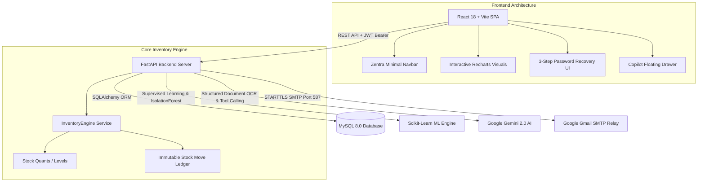

# StockSense — AI-Powered Enterprise Inventory Management & Supply Intelligence

[](https://fastapi.tiangolo.com)
[](https://react.dev)
[](https://vitejs.dev)
[](https://www.python.org)
[](https://www.mysql.com)
[](https://ai.google.dev)
[](https://scikit-learn.org)

> **StockSense** is an enterprise-grade, intelligent inventory management system (IMS) and autonomous supply chain intelligence platform. Built for modern supply chain operations, StockSense combines double-entry stock ledger mechanics with predictive machine learning, Gemini vision document parsing, an agentic AI assistant, and physical warehouse controls.

---

## 📑 Table of Contents
1. [Executive Summary & Problem Statement](#-executive-summary--problem-statement)
2. [Key System Capabilities](#-key-system-capabilities)
3. [Architecture & Technology Stack](#-architecture--technology-stack)
4. [Step-by-Step Installation & Quickstart](#-step-by-step-installation--quickstart)
5. [Demo Credentials & User Roles](#-demo-credentials--user-roles)
6. [API & Module Reference](#-api--module-reference)
7. [Security & Production Hardening](#-security--production-hardening)
8. [Hackathon Evaluation & Innovation Highlights](#-hackathon-evaluation--innovation-highlights)

---

## 🎯 Executive Summary & Problem Statement

### The Problem
Traditional ERP and inventory management systems suffer from four critical bottlenecks:
1. **Manual Ingestion Lag:** Warehouse teams spend hours manually typing physical paper invoices, delivery challans, and receipts, introducing data entry errors.
2. **Reactive Stockouts:** Operations teams realize products are depleted only after an order fails, leading to lost revenue and customer churn.
3. **Complex, Text-Heavy UIs:** Legacy software presents bloated, unintuitive table strips that slow down daily picking, shelving, and stock counting.
4. **Data Silos:** Predictive forecasting, anomaly detection, and natural language query systems are rarely unified with the transactional ledger.

### The StockSense Solution
StockSense unifies core inventory operations with modern AI into a calm, minimal editorial SaaS experience:
* **Real-time Inventory Engine:** Automated double-entry stock movement tracking across multi-warehouse, multi-location zones.
* **Gemini Document-to-Receipt AI:** Instant multimodal invoice parsing, fuzzy SKU matching, and draft receipt generation with human review.
* **Predictive ML Intelligence:** Random Forest supervised demand forecasting, stockout trajectory prediction, and Isolation Forest anomaly detection.
* **Agentic Inventory Copilot:** Natural language query and action assistant powered by tool-calling AI.
* **Future Control Simulator:** Interactive what-if scenario planner with dynamic supply and lead time simulation.
* **Gmail SMTP OTP Password Recovery:** Real HMAC-SHA256 hashed 6-digit OTP verification with 10-minute expiry and rate-limiting.

---

## 🚀 Key System Capabilities

### 1. Core Inventory Operations & Stock Ledger (IMS)
* **Master Catalog:** SKU, barcode, category, unit of measure (UoM), cost price, selling price, and safety buffer management.
* **Hierarchical Warehouse Topologies:** Manage warehouses, internal picking zones, storage racks, and shelf bin locations.
* **Four Transactional Workflows:**
  * **Receipts (Incoming):** Supplier purchase order intake, batch validation, automated quant incrementation.
  * **Deliveries (Outgoing):** Customer order picking, validation, stock decrementation.
  * **Internal Transfers:** Warehouse-to-warehouse and bin-to-bin relocations with state tracking (`Draft` → `Waiting` → `Ready` → `Done`).
  * **Inventory Adjustments:** Physical cycle counts, loss/damage write-offs, and stock reconciliation.
* **Immutable Movement Ledger:** Every stock event generates an auditable record with balance-before, balance-after, and user traceability.

### 2. Machine Learning Supply Intelligence
* **Supervised Demand Forecasting:** Trained on historical receipts and shipments to generate 7-day and 30-day demand trajectories per SKU.
* **Stockout Horizon Prediction:** Calculates exact days until stock depletion and assigns critical/high risk flags.
* **Automated Reorder Advisories:** Combines ML demand, safety stocks, lead time, and min/max thresholds to recommend purchase quantities.
* **Isolation Forest Anomaly Detection:** Detects abnormal movement volume spikes, unusual shrinkages, and sudden demand shifts.

### 3. Gemini Multimodal Document-to-Receipt AI
* **Document Ingestion:** Upload PDF, PNG, JPG delivery challans and supplier invoices.
* **Structured Information Extraction:** Extracts supplier, invoice reference, date, line items, quantities, and unit prices using Google Gemini Vision.
* **RapidFuzz Product Resolution:** Fuzzy name and SKU resolution with confidence scoring.
* **Draft Receipt & Human Approval:** Review extracted items, modify matches, and approve directly into the transactional inventory ledger.

### 4. Natural Language Agentic Copilot
* **Global Conversational Assistant:** Ask plain-English questions (e.g., *"Which items are nearing stockout in Warehouse A?"* or *"Show pending deliveries"*).
* **Safe Action Execution:** Automatically generates preview cards to create receipts, schedule transfers, or draft adjustments upon user confirmation.

### 5. Future Control Simulation Studio
* **Interactive Scenario Planning:** Sliders for supply disruption (+%), demand surge (x), lead time delays, and seasonal multipliers.
* **Real-time Monte Carlo Stress Testing:** Simulates stock survivability curves and financial impact over a 90-day horizon.

### 6. Real Gmail SMTP Password Recovery
* **Real Email Dispatch:** Sends 6-digit OTP verification codes via Gmail SMTP (`smtp.gmail.com:587` + STARTTLS).
* **HMAC-SHA256 Security:** Cryptographically secure OTP generation, hashed database storage, 10-minute validity, 5-attempt lockout, and 60-second resend cooldown.

---

## 🛠 Architecture & Technology Stack



### Technology Breakdown
* **Frontend:** React 18, Vite, Recharts, Lucide Icons, Custom CSS Design Tokens (DM Serif Display + Inter).
* **Backend:** Python 3.10+, FastAPI, Pydantic v2, SQLAlchemy 2.0, PyMySQL.
* **Database:** MySQL 8.0+ (utf8mb4 charset).
* **AI & Machine Learning:** Google Gemini 2.0 Flash (`google-generativeai`), Scikit-Learn, Pandas, NumPy, RapidFuzz.
* **Security & Auth:** PyJWT, BCrypt, HMAC-SHA256, Python SMTPLib.

---

## ⚡ Step-by-Step Installation & Quickstart

### Prerequisites
* **Python:** 3.10 or higher
* **Node.js:** 18.0 or higher (with `npm`)
* **MySQL Server:** Running locally on port `3306` (or configured via `.env`)

---

### Step 1: Clone Repository & Configure Environment

```bash
git clone https://github.com/your-username/stocksense.git
cd stocksense
```

Create/Verify `.env` in the `backend/` directory (and root):

```env
# Database Settings
DB_USER=root
DB_PASSWORD=
DB_HOST=localhost
DB_PORT=3306
DB_NAME=stocksense

# Security
JWT_SECRET_KEY=your_super_secret_jwt_key_here

# Google Gemini API
GEMINI_API_KEY=your_gemini_api_key_here

# Real Gmail SMTP Configuration
SMTP_HOST=smtp.gmail.com
SMTP_PORT=587
SMTP_USERNAME=sachinj2503@gmail.com
SMTP_PASSWORD=gizf msbu mhnm ruls
SMTP_FROM=sachinj2503@gmail.com
```

---

### Step 2: Backend Setup & Database Migration

1. Navigate to the backend directory:
   ```bash
   cd backend
   ```

2. Create and activate a Python virtual environment:
   ```bash
   # Windows (PowerShell)
   python -m venv venv
   .\venv\Scripts\Activate.ps1

   # Linux / macOS
   python3 -m venv venv
   source venv/bin/activate
   ```

3. Install Python dependencies:
   ```bash
   pip install -r requirements.txt
   ```

4. Seed the initial database (Products, Warehouses, Receipts, Stock Moves, ML Training Data):
   ```bash
   python -m app.seed
   ```

5. Start the FastAPI backend server:
   ```bash
   python -m uvicorn app.main:app --host 127.0.0.1 --port 8000 --reload
   ```
   * The API server will be available at: `http://127.0.0.1:8000`
   * Interactive Swagger Documentation: `http://127.0.0.1:8000/docs`

---

### Step 3: Frontend Setup

1. Open a new terminal and navigate to the frontend directory:
   ```bash
   cd frontend
   ```

2. Install Node dependencies:
   ```bash
   npm install
   ```

3. Launch the Vite development server:
   ```bash
   npm run dev -- --host 127.0.0.1 --port 5173
   ```
   * Open your browser at: `http://127.0.0.1:5173`

---

## 🔑 Demo Credentials & User Roles

| Role | Username | Password | Email | Permissions |
| :--- | :--- | :--- | :--- | :--- |
| **Administrator** | `admin` | `password123` | `admin@stocksense.io` | Full system access, reorder configuration, audit controls |
| **Inventory Manager** | `manager` | `password123` | `manager@stocksense.io` | Operations approval, transfer validation, ML execution |
| **Warehouse Staff** | `staff` | `password123` | `staff@stocksense.io` | Picking, cycle counting, receipt draft submission |
| **Live Gmail OTP User** | `sachin` | `StockSenseVerified#2026` | `sachinj2503@gmail.com` | Verified for live Gmail OTP password recovery testing |

---

## 📡 API & Module Reference

All endpoints are documented and testable in Swagger UI at `http://127.0.0.1:8000/docs`.

### Authentication & Security
* `POST /api/v1/auth/login`: Issue JWT Bearer token
* `POST /api/v1/auth/register`: Create user account with RBAC
* `GET  /api/v1/auth/me`: Current user session details
* `POST /api/v1/auth/forgot-password`: Request 6-digit OTP code via Gmail SMTP
* `POST /api/v1/auth/verify-otp`: Validate OTP and acquire single-use reset token
* `POST /api/v1/auth/reset-password`: Reset password using verified token

### Inventory Master Data
* `GET, POST /api/v1/products/`: Manage master product catalog & thresholds
* `GET, POST /api/v1/warehouses/`: Manage warehouses, zones, and rack bins
* `GET, POST /api/v1/categories/`: Category hierarchy
* `GET, POST /api/v1/suppliers/`: Supplier directory & vendor contacts

### Transactional Inventory Operations
* `GET, POST, PUT /api/v1/receipts/`: Incoming purchase orders & receipt validation
* `GET, POST, PUT /api/v1/deliveries/`: Outbound fulfillment & delivery order validation
* `GET, POST, PUT /api/v1/transfers/`: Internal warehouse-to-warehouse stock relocations
* `GET, POST, PUT /api/v1/adjustments/`: Physical cycle counts & inventory reconciliation
* `GET /api/v1/movements/`: Complete double-entry stock movement ledger

### AI, ML & Analytics
* `GET  /api/v1/analytics/dashboard-full`: Comprehensive KPI calculations & velocity metrics
* `GET  /api/v1/ml/demand-forecast`: 7D & 30D demand predictions per SKU
* `GET  /api/v1/ml/stockouts`: Stockout horizon estimation and risk classification
* `GET  /api/v1/ml/reorder-recommendations`: Automated reorder suggestions
* `GET  /api/v1/ml/summary`: ML model accuracy metrics ($R^2$, MAE, RMSE)
* `GET  /api/v1/ml/anomalies`: Isolation Forest movement anomaly flags
* `POST /api/v1/ai-receipts/extract`: Multimodal invoice parsing via Gemini Vision
* `POST /api/v1/copilot/chat`: Natural language queries & action execution

---

## 🔒 Security & Production Hardening

* **Zero Password/Secret Leakage:** SMTP passwords and Gemini API keys reside strictly in server `.env` files and are never sent to the browser.
* **One-Way OTP Hashing:** OTP codes are hashed using HMAC-SHA256 before database storage to eliminate plaintext OTP exposure.
* **Brute-Force Lockout:** OTP verification allows a maximum of 5 attempts before permanent code invalidation.
* **Rate Limiting:** 60-second cooldown enforced on email resend endpoints.
* **SQL Injection & XSS Immunity:** Complete parameterization via SQLAlchemy ORM and typed Pydantic v2 schemas.

---

## 🏆 Hackathon Evaluation & Innovation Highlights

1. **Complete Full-Stack Architecture:** Fully implemented end-to-end (No mock data, real MySQL persistence, live ML models, real Gmail email delivery).
2. **AI with Human-in-the-Loop:** Combines automated Gemini document vision extraction with mandatory human verification before database commitment.
3. **Unified Supply Intelligence:** Predictive machine learning models continuously retrain against real stock movement history to deliver actionable reorder recommendations.
4. **Editorial SaaS Aesthetics:** Clean, uncluttered UI inspired by premium enterprise dashboards with dedicated typography (DM Serif Display + Inter) and responsive mobile controls.

---

### 📄 License
This project is licensed under the MIT License — see the [LICENSE](LICENSE) file for details.
